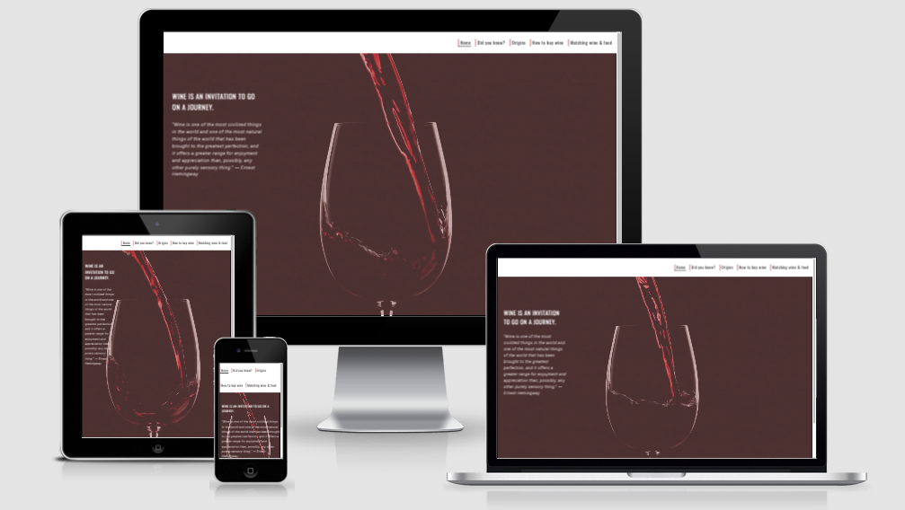
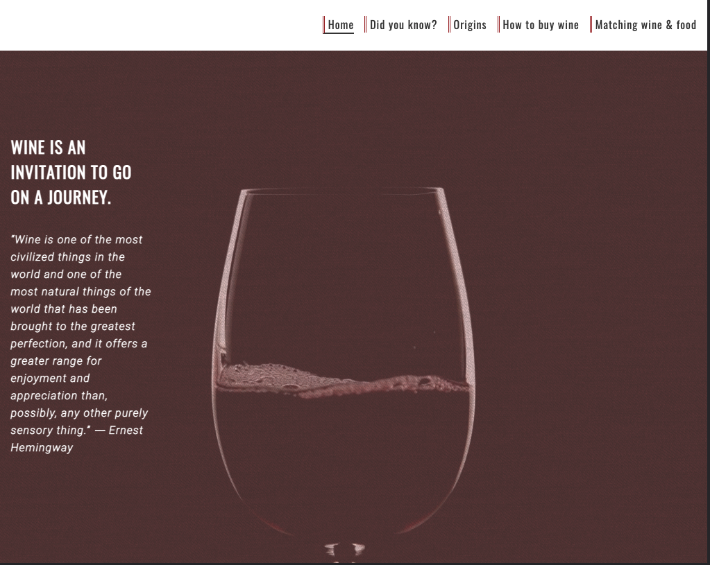
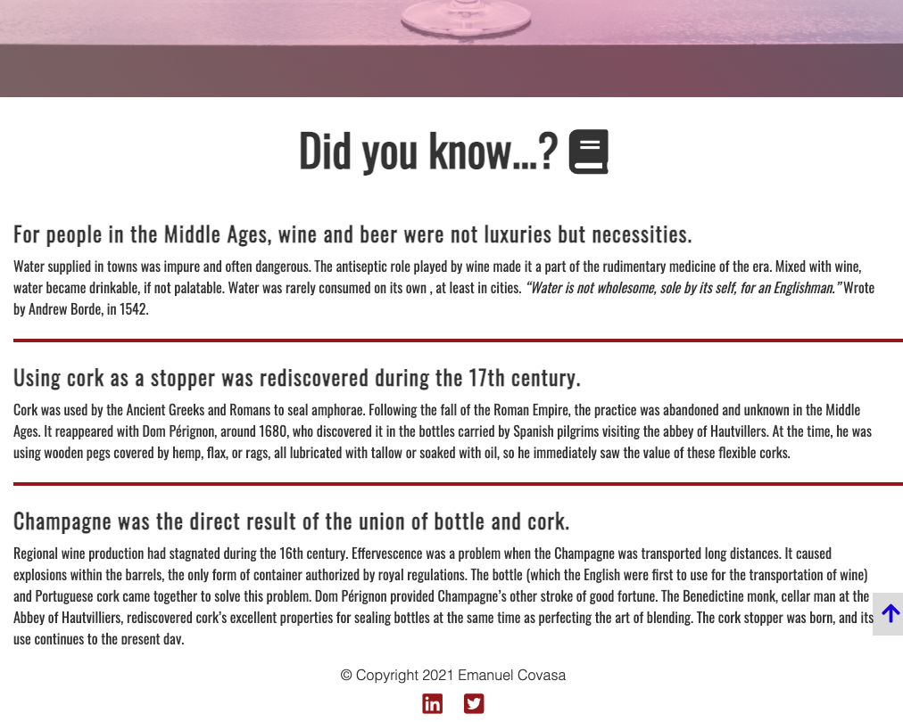
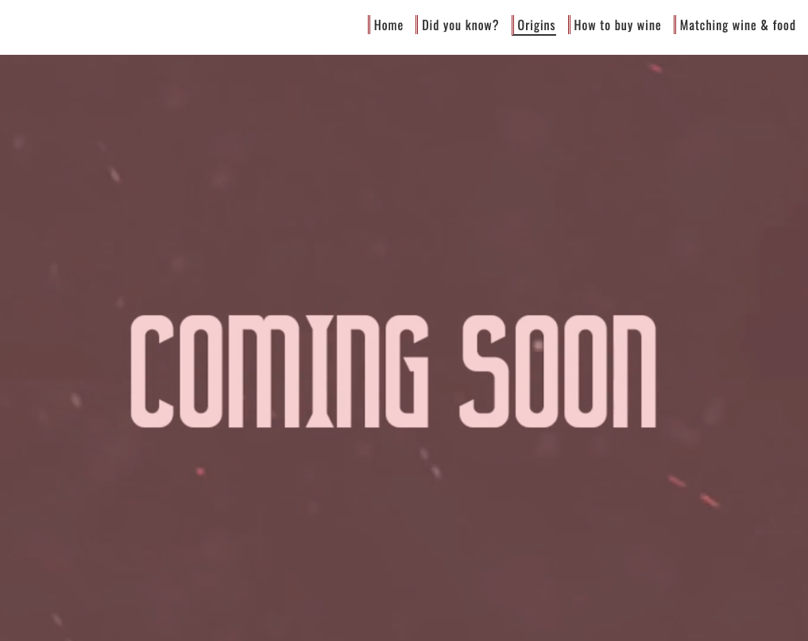

# Complete Wine Guide
> The aim of this project is to bring as much information about wine to all enthusiasts and build a community for wine lovers. 
> Link [_here_](https://emicovasa.github.io/completewineguide/index.html). 
> 
## Table of Contents
* [General Info](#general-information)
* [Technologies Used](#technologies-used)
* [Screenshots](#screenshots)
* [Usage](#usage)
* [Project Status](#project-status)
* [Acknowledgements](#acknowledgements)
* [Contact](#contact)

## General Information
> On completion the website will include detailed information about the history and origin of wine, interactive facts regarding the world of wine, multiple guides to : how to indetify a wine, how to buy wine, how to store wine, how to match wine with food, how to serve wine, how to taste wine, picking the perfect wine for different ocasions. It will also provide information about some of the great wine regions of the world.
>The information that the website will containe will be sourced from the knowledge I acquired in over 8 years of working in the hospitality industry and also a colection of books. 

## Technologies Used
> HTML5
> CSS

## Screenshots

## Project Status
> Project is: _in progress_ 

## Acknowledgements
> Home page was inspired from youtube tutorials made by Mr Digital [youtube channel](https://www.youtube.com/channel/UCrGZCgKfpPANtEG0bHESUOA)
> Animation code for hero image by Naoya [Link](https://csshint.com/css-hero-effects/)

## Contact
> Created by Emanuel Covasa e.covasa@gmail.com [LinkedIn](https://www.linkedin.com/in/16051985/) 

